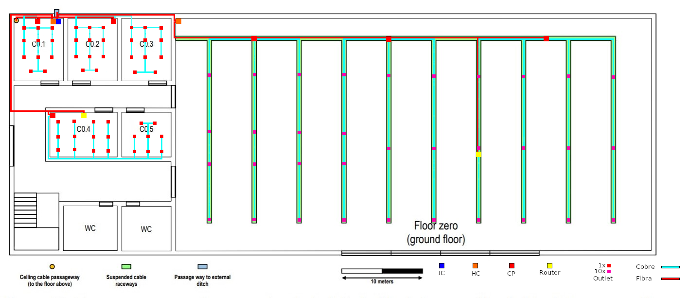
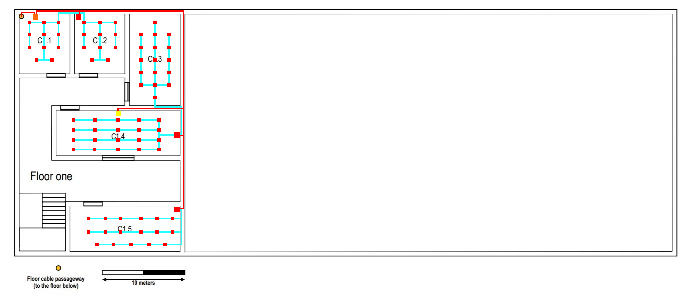

RCOMP 2019-2020 Project - Sprint 1 - Member 1170167 folder
===========================================

## Edifício C

Para este projeto, fiquei encarregue de cobrir o Edifício C com cobertura de Wi-fi.

### Piso 0

Este piso contém:

- 1 Intermediate cross-connect (IC)
- 2 Horizontal cross-connect (HC)
- 6 Consolidation Point (CP) ou Switches
  - 1 Switch com 16 portas
  - 2 Switch com 24 portas
  - 3 Switch com 128 portas
- 2 Access Point (Ac) ou Routers
- 390 Outlets
- 172,8 metros de Fibra Ótica
- 1150,1 metros de Cobre.

Nota: O total de Fibra ótica já têm em conta a redundância, tendo assim 2 cabos de fibra a ligar de um IC a um HC.

### Piso 1

Este piso contém:

- 1 Intermediate cross-connect (IC)
- 1 Horizontal cross-connect (HC)
- 3 Consolidation Point (CP) ou Switches
  - 2 Switch com 24 portas
  - 1 Switch com 48 portas
- 1 Access Point (Ac) ou Routers
- 72 Outlets
- 99,4 metros de Fibra Ótica
- 938,6 metros de Cobre.

Nota: O total de Fibra ótica já têm em conta a redundância, tendo assim 2 cabos de fibra a ligar de um IC a um HC.

### Medidas

As medidas de cada sala de ambos os pisos são:

| Escala: | 2,9cm ⇔ 10m |         |        | Real = [(imagem)*10]/2,9 |        |         |
|---------|-------------|---------|--------|--------------------------|--------|---------|
| Medidas | Ci (cm)     | Li (cm) | Cr (m) | Lr (m)                   | A (m²) | Outlets |
| C0.1    | 1,7         | 2,2     | 5,86   | 7,59                     | 44     | 11      |
| C0.2    | 1,7         | 2,2     | 5,86   | 7,59                     | 44     | 11      |
| C0.3    | 1,7         | 2,2     | 5,86   | 7,59                     | 44     | 11      |
| C0.4    | 2,5         | 1,6     | 8,62   | 5,52                     | 48     | 12      |
| C0.5    | 1,7         | 1,6     | 5,86   | 5,52                     | 32     | 8       |
| Salão   | 17          | 8,3     | 58,62  | 28,62                    | 1678   | 338     |
| C1.1    | 1,8         | 2,1     | 6,21   | 7,24                     | 45     | 11      |
| C1.2    | 1,8         | 2,1     | 6,21   | 7,24                     | 45     | 11      |
| C1.3    | 1,8         | 3,2     | 6,21   | 11,03                    | 68     | 16      |
| C1.4    | 4,3         | 1,6     | 14,83  | 5,52                     | 82     | 18      |
| C1.5    | 3,8         | 1,6     | 13,10  | 5,52                     | 72     | 16      |
