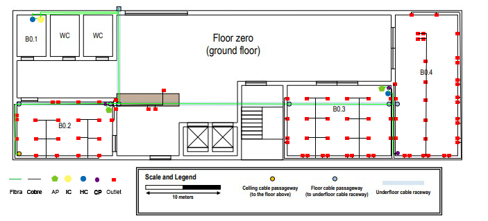

RCOMP 2019-2020 Project - Sprint 1 - Member 1171060 folder
===========================================

## Edifício B

Para este projeto, fiquei encarregue de cobrir o Edifício B.
Os Access Points estão distribuidos de maneira a cobrir totalmente o edifício,
no piso 1 existem 3 AP devido à necessidade de atravessar um grande número de
obstáculos. Na sala B0.1 existe uma "Telecommunication Room" onde estão
guardados o IC e 1 dos HC.

## Piso 0 (Ground Floor)

#### Medidas (Por Sala):

| Medidas | Ci (cm) | Li (cm) | Cr (m) | Lr (m) | A (m²) | Outlets |
|---------|---------|---------|--------|--------|--------|---------|
| B0      | 13      | 4       | 59     | 20     | 1151   | 84      |
| B0.2    | 3       | 2       | 13     | 7      | 89     | 20      |
| B0.3    | 3       | 2       | 14     | 9      | 125    | 27      |
| B0.4    | 2       | 4       | 8      | 18     | 151    | 32      |
| desk    | 2       | 0       | 8      | 2      | 14     | 5       |

[Cablagem de Cobre](GroundFloorCopperMeasures.md)  
[Cablagem de Fibra](GroundFloorFiberMeasures.md)

#### Inventário:
* 1 IC
* 2 HC:
    * 2 Switch Fibra Ótica 24 Portas
    * 2 Patch Panel Fibra Ótica 24 portas
* 3 CP:   
    * 3 Switch 48 portas
    * 3 Patch Panel 48 portas
* 84 outlets
* 87 Patch Coords
* 1500 metros de cabo Cat6
* 300 metros de cabo de Fibra Ótica
* 2 Access Points

## Piso 1

#### Medidas (Por Sala):

| Medidas | Cr (m) | Lr (m) | A (m²) | Outlets |
|---------|--------|--------|--------|---------|
| B1      | 59,33  | 19,75  | 1172   | 123     |
| B1.1    | 3,88   | 5,5    | 21     | 6       |
| B1.2    | 4,38   | 8,21   | 36     | 9       |
| B1.3    | 4,92   | 8,25   | 41     | 10      |
| B1.4    | 5      | 8,21   | 41     | 10      |
| B1.5    | 4,92   | 8,25   | 41     | 10      |
| B1.6    | 4,96   | 9,29   | 46     | 11      |
| B1.7    | 4,96   | 9,38   | 47     | 11      |
| B1.8    | 4,92   | 9,38   | 46     | 11      |
| B1.9    | 6,04   | 13,17  | 80     | 18      |
| B1.10   | 10,96  | 4,96   | 54     | 13      |
| B1.11   | 10,96  | 5      | 55     | 13      |

[Cablagem de Cobre](FirstFloorCopperMeasures.md)  
[Cablagem de Fibra](FirstFloorFiberMeasures.md)

#### Inventário:
* 2 HC:
    * 2 Switch Fibra Ótica 24 Portas
    * 2 Patch Panel Fibra Ótica 24 portas
* 6 CP:  
    * 4 Switch 24 portas
    * 4 Patch Panel 24 portas
    * 2 Switch 48 portas
    * 2 Patch Panel 48 portas
* 123 outlets
* 125 Patch Coords
* 1200 metros de cabo Cat6
* 150 metros de cabo de Fibra Ótica
* 3 Access Points
