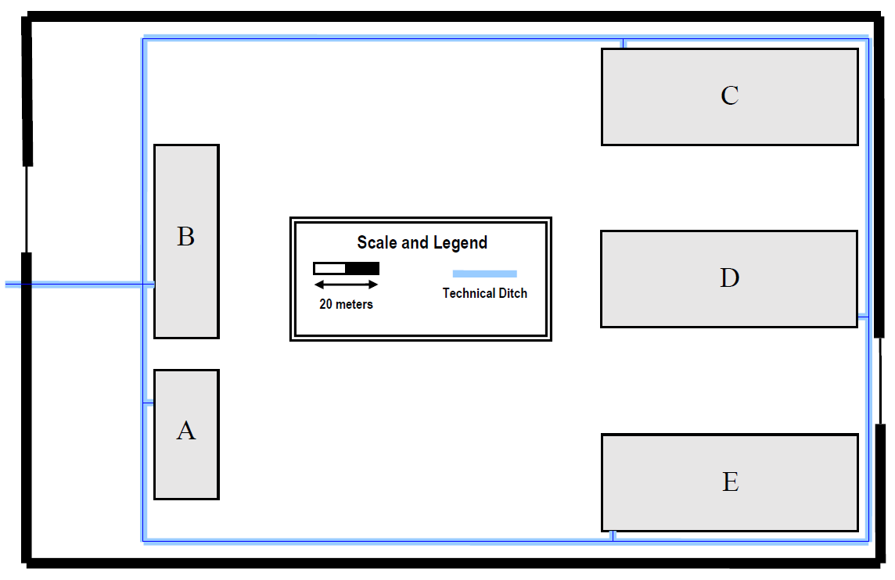
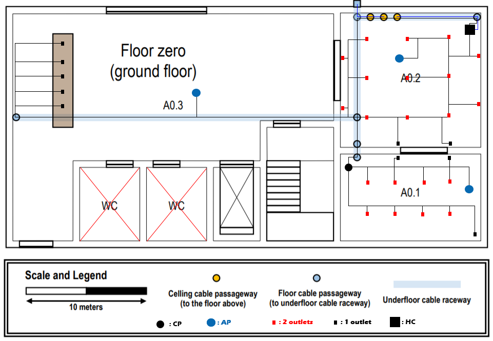
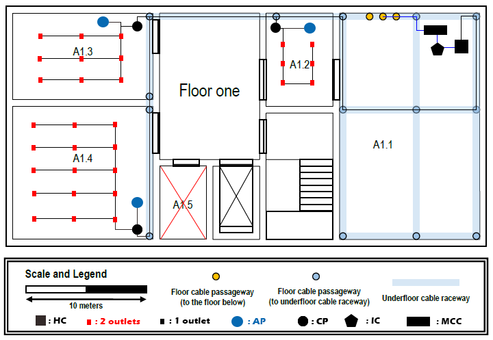

RCOMP 2019-2020 Project - Sprint 1 - Member 1180778 folder
===========================================

# Conexões Entre Edifícios

Entre os edifícios ligamos com 2 cabos de fibra ótica (representada a azul nesta imagem e em todas as seguintes imagens, no que diz respeito a cablagem de fibra ótica) e esta ligação é feita a partir do edifício A, que tem o MCC e que distribui a informação para os restantes edifícios.

Os edifícios encontram-se ligados entre eles individualmente e, ligados ao edifício A, ou seja:

* A-B
* A-C
* A-D
* A-E
* B-C
* C-D
* D-E
* E-A

Assim, na eventualidade de uma ligação ser cortada entre o A e outro edifício, as ligações percorrem todos os edifícios e garantem estabilidade para todos os edifícios.

Total de cabo de fibra: 1500 metros.

[Cablagem de Fibra](ComplexFiberMeasures.md)

# Edifício A

Cada sala irá conter um Access Point para garantir a cobertura total deste piso e, no caso de existirem muitos utilizadores da rede Wireless esta se manter estável e rápida para todos os utilizadores.

## Piso 0 (Ground Floor)

#### Medidas (Por Sala):

| Sala | Ci (cm) | Li (cm) | Cr (m) | Lr (m) | A (m²) | Outlets |
|---------|---------|---------|--------|--------|--------|---------|
| A0      | 15,27   | 7,66    | 40     | 20     | 793    | 52      |
| A0.1    | 4,51    | 2,78    | 12     | 7      | 85     | 19      |
| A0.2    | 4,51    | 4,3     | 12     | 11     | 132    | 28      |
| A0.3    | 0       | 0       | 0      | 0      | 0      | 5       |

[Cablagem de Cobre](GroundFloorCopperMeasures.md)  
[Cablagem de Fibra](GroundFloorFiberMeasures.md)

#### Inventário:
* 1 HC:
    * 1 Switch 48 Portas
    * 1 Patch Panel 48 portas
* 1 CP:   
    * 1 Switch 24 portas
    * 1 Patch Panel 24 portas
* 52 outlets
* 52 Patch Coords
* 500 metros de cabo Cat6
* 35 metros de cabo de Fibra Ótica
* 3 Access Points
* 1 Switch Fibra Ótica 24 portas
* 1 Patch Pannel Fibra Ótica 24 portas

## Piso 1

É indicado que a sala A1.1 é o 'data center' e, por isso, parece lógico que seja aqui que se coloca o MCC que irá distribuir para o campus inteiro, o IC para o edifício A e  HC para o piso 1.

#### Medidas (Por Sala):

| Medidas | Ci (cm) | Li (cm) | Cr (m) | Lr (m) | A (m²) | Outlets |
|---------|---------|---------|--------|--------|--------|---------|
| A1      | 15,27   | 7,66    | 40     | 20     | 793    | 59      |
| A1.1    | 7,37    | 4,56    | 19     | 12     | 228    | 0       |
| A1.2    | 3,04    | 2,18    | 8      | 6      | 45     | 11      |
| A1.3    | 4,56    | 2,81    | 12     | 7      | 87     | 19      |
| A1.4    | 4,56    | 4,34    | 12     | 11     | 134    | 29      |
| A1.5    | 2,38    | 1,55    | 6      | 4      | 25     | 0       |

[Cablagem de Cobre](FirstFloorCopperMeasures.md)  
[Cablagem de Fibra](FirstFloorFiberMeasures.md)

#### Inventário:
* 1 MCC (Main cross-connect)
* 1 IC (Intermediate cross-connect)
* 1 HC (Horizontal cross-connect):
    * 1 Switch 48 Portas
    * 1 Patch Panel 48 portas
* 3 CP's (Consolidation Points):
    * 3 Switch 24 portas
    * 3 Patch Panel 24 portas
* 59 outlets
* 59 patch coords
* 650 metros de cabo Cat6
* 15 metros de cabo de Fibra Ótica
* 3 Access Points

###### Nota: a azul está a linha de fibra e a preto a linha de cobre, em todas as imagens.
