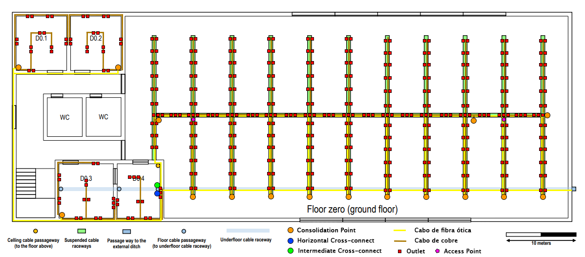
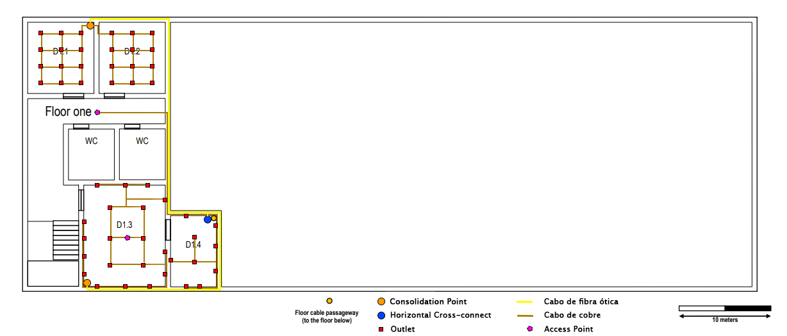

RCOMP 2019-2020 Project - Sprint 1 - Member 1180813 folder
===========================================
## Edifício D

### Medições das Plantas
| Medidas | C (cm) | L (cm) | C (m) | L (m) | A (m²)           | Outlets |
|---------|---------|---------|--------|--------|------------------|---------|
| D0.1    | 2,3     | 2,5     | 7,9    | 8,6    | 68,4             | 16      |
| D0.2    | 2,3     | 2,5     | 7,9    | 8,6    | 68,4             | 16      |
| D0.3    | 2,5     | 2,5     | 8,6    | 8,6    | 74,3             | 17      |
| D0.4    | 2,0     | 2,5     | 6,9    | 8,6    | 59,5             | 14      |
| D1.1    | 2,0     | 2,1     | 6,9    | 7,2    | 49,9             | 12      |
| D1.2    | 2,0     | 2,1     | 6,9    | 7,2    | 49,9             | 12      |
| D1.3    | 3,0     | 2,4     | 10,3   | 8,3    | 85,6             | 19      |
| D1.4    | 2,1     | 1,4     | 7,2    | 4,8    | 35,0             | 9       |
| SALÃO   |         |         |        |        |                  |         |
|         |         |         |        |        |                  |         |
| PEQUENO | 5,6     | 1,5     | 19,3   | 5,2    | 99,9             | 22      |
| GRANDE  | 15,8    | 7,9     | 54,5   | 27,2   | 1484,2           | 299     |
|         |         |         |        |        |        | TOTAL DE OUTLETS |
|         |         |         |        |        |                  |         |
|         |         |         |        |        |          |321        |
|         |         |         |        |        |                  |         |

### Planta do Piso 0

#### Inventário
- 826 metros de cabo de fibra ótica monomodo;
- 4795 metros de cabo de cobre CAT6;
- 384 outlets;
- 2 access points;
- 16 patch panel de fibra ótica;
- 17 patch panels de cobre;
- 19 switches de 24 portas
- 17 telecommunications enclosures.
- 16 consolidation points;
- 1 horizontal cross-connect;
- 1 intermediate cross-connect.

### Planta do Piso 1

#### Inventário
- 58 metros de cabo de fibra ótica monomodo;
- 544,5 metros de cabo de cobre CAT6;
- 52 outlets;
- 1 access point;
- 3 patch panels de fibra ótica;
- 3 switches de 24 portas;
- 3 telecommunications enclosures.
- 2 consolidation points;
- 1 horizontal cross-connect.
