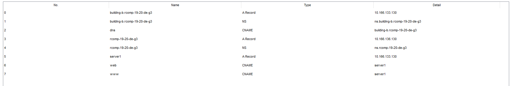

RCOMP 2019-2020 Project - Sprint 3 - Member 1171060 folder
===========================================
# BUILDING B

In this document there will be all the commands I used to configurate different devices.

It was necessary to reconfigure the vlans in the building B router:

B_Wifi_VLAN:
interface FastEthernet 1/0.282
encapsulation dot1Q 282
ip address 10.166.132.1 255.255.255.128
no shutdown
exit

B_Floor1_VLAN:
interface FastEthernet 1/0.281
encapsulation dot1Q 281
ip address 10.166.132.129 255.255.255.128
no shutdown
exit

B_Floor0_VLAN:
interface FastEthernet 1/0.280
encapsulation dot1Q 280
ip address 10.166.133.1 255.255.255.192
no shutdown
exit

B_VoIP_VLAN:
interface FastEthernet 1/0.284
encapsulation dot1Q 284
ip address 10.166.133.65 255.255.255.192
no shutdown
exit

B_DMZ_VLAN:
interface FastEthernet 1/0.283
encapsulation dot1Q 283
ip address 10.166.133.129 255.255.255.240
no shutdown
exit

# OSPF COMMANDS #

router ospf 1
network 10.166.142.0 255.255.254.0 area 0  
network 10.166.132.0 255.255.254.0 area 2  

Principal Router:
router ospf 1
network 10.166.142.0 255.255.254.0 area 0  
network 10.166.136.0 255.255.254.0 area 1  
network 10.166.132.0 255.255.254.0 area 2  
network 10.166.128.0 255.255.254.0 area 3
network 10.166.140.0 255.255.254.0 area 4

# DHCP / DNS COMMANDS #

ip dhcp pool B_Wifi_VLAN
network 10.166.132.0 255.255.255.128
default-router 10.166.132.1
domain-name building-b.rcomp-19-20-de-g3
dns-server 10.166.133.130

ip dhcp pool B_Floor1_VLAN
network 10.166.132.128 255.255.255.128
default-router 10.166.132.129
domain-name building-b.rcomp-19-20-de-g3
dns-server 10.166.133.130

ip dhcp pool B_Floor0_VLAN
network 10.166.133.0 255.255.255.192
default-router 10.166.133.1
domain-name building-b.rcomp-19-20-de-g3
dns-server 10.166.133.130

ip dhcp pool B_VoIP_VLAN
default-router 10.166.133.65
option 150 ip 10.166.133.65
network 10.166.133.64 255.255.255.192
domain-name building-b.rcomp-19-20-de-g3
dns-server 10.166.133.130

ip dhcp excluded-address 10.166.132.1
ip dhcp excluded-address 10.166.132.129
ip dhcp excluded-address 10.166.133.1
ip dhcp excluded-address 10.166.133.65

# VoIP COMMANDS #

interface FastEthernet7/1  
switchport mode access  
switchport voice vlan 284  
no switchport access vlan

interface FastEthernet5/1  
switchport mode access  
switchport voice vlan 295  
no switchport access vlan  

telephony-service  
auto-reg-ephone  
ip source-address 10.166.133.65 port 2000  
max-ephones 20  
max-dn 20  
auto assign 1 to 2

ephone-dn 1  
number 2001  

ephone-dn 2  
number 2002

dial-peer voice 1000 voip
destination-pattern 1...
session target ipv4:10.166.137.161

dial-peer voice 3000 voip
destination-pattern 3...
session target ipv4:10.166.129.193

dial-peer voice 4000 voip
destination-pattern 4...
session target ipv4:10.166.141.193

# DNS #

# NAT COMMANDS #

ip nat inside source static tcp 10.166.133.130 80 10.166.136.0 8081
ip nat inside source static tcp 10.166.133.130 443 10.166.136.0 8082
